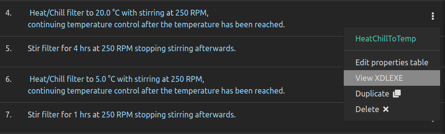
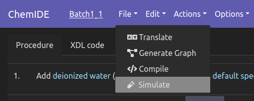
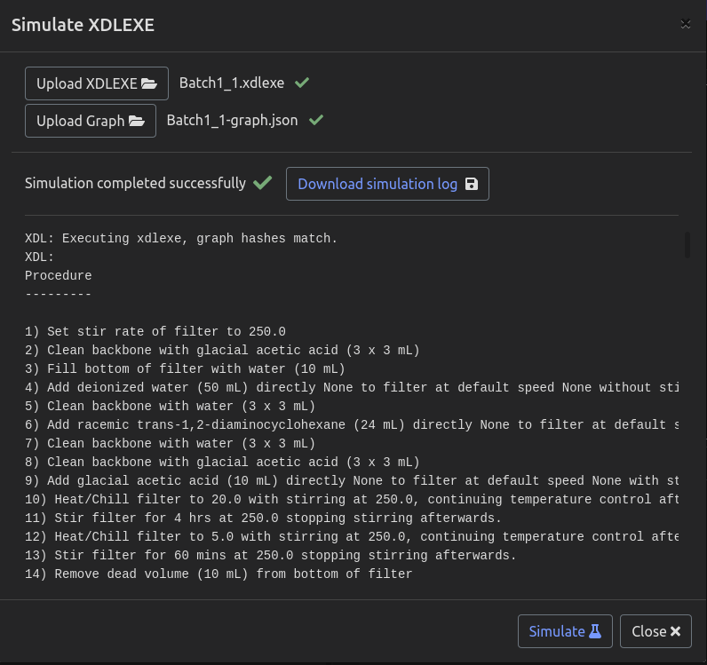

Simulate / Execute XDL
======================

Python
******

Before executing you may wish to inspect the .xdlexe to make sure that is it planning
to do what you want it to do. This can be done by opening it in your text editor
of choice, or in ChemIDE by clicking the three-dot menu icon next to any step,
and then clicking "View XDLEXE".

Once you are ready to run the xdlexe, it is just a matter of
instantiating the platform controller, and passing it to the xdlexe execute method.

It is highly advisable to first execute in simulation mode, before running on a physical
platform, to avoid any unexpected runtime errors. Simulation is toggled within the platform controller.

.. code-block:: python

    from xdl import XDL

    xdlexe = XDL('procedure.xdlexe')

    xdlexe.execute(platform_controller)

Instantiating the Platform Controller
^^^^^^^^^^^^^^^^^^^^^^^^^^^^^^^^^^^^^

This depends on the platform being used, but as an example, the Chemputer
platform controller instantiation is shown here.

::

    from chempiler import Chempiler
    import ChemputerAPI

    platform_controller = Chempiler(
        experiment_code="procedure",
        output_dir="/path/to/experiment_folder",
        graph_file="procedure_graph.json",
        device_modules=[ChemputerAPI],
        simulation=True,
    )

ChemIDE
*******

Currently ChemIDE does not support execution of procedures although this is in
development. It does however support simulation of procedures.

Simulation can be done by going to the Actions menu and clicking "Simulate".

You will then have the option to upload a .xdlexe file and a graph if they are not
already loaded. You can run a simulation by clicking "Simulate". Simulation logs will be
shown with the option to download as a .txt file.

