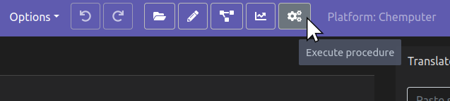
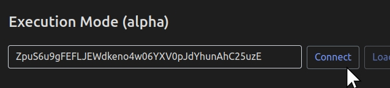
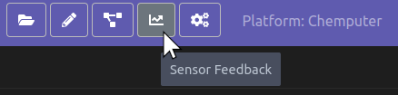
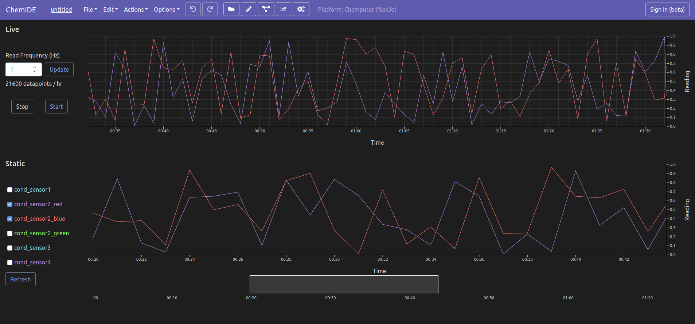

Sensor Reading
==============

This page provides a guide on how to take regular sensor readings in the
background of an experiment, and save them to a file / visualise them. It is specific to the Chemputer and not relevant at the moment to any other platform.

Python
^^^^^^

The following shows how to record background sensor readings using Python. All
sensor readings are stored in a file called `sensor-readings.json` in the
log folder. Readings will be taken from all devices in the graph capable of taking readings.

.. code-block:: python

   from chempiler import Chempiler

   # Instantiate chempiler
   c = Chempiler(**params)

   # Start taking background sensor readings
   c.start_sensor_thread()

   # Stop taking background sensor readings but leave thread open
   c.pause_sensor_thread()

   # Start taking background sensor readings after a pause
   c.resume_sensor_thread()

   # Stop taking background sensor readings and join thread
   c.stop_sensor_thread()

   # Change interval in seconds at which readings are taken. Defaults to 2.
   # Can be changed at any time even if sensor thread is running.
   c.SENSOR_READ_INTERVAL = 5

ChemIDE
^^^^^^^

If you operate the sensor reading using ChemIDE, then the sensor readings
will still be saved in `sensor-readings.json`, but will also be visualised in
real-time in ChemIDE.

To do this, first you must connect the Chempiler object to ChemIDE.

.. code-block:: python

   # Instantiate chempiler
   c = Chempiler(**params)

   # Run execution client that will connect to the ChemIDE server.
   c.run_execution_client()

Running this in a Jupyter notebook or iPython session will print out a
unique key that you can then paste into ChemIDE execution mode and click
"Connect".

After this, ChemIDE and the Chempiler object will be connected and you can go to the sensor mode.

Here, you can control all of the sensor reading functionality using the
Start / Stop buttons and the Read Frequency input.
The read frequency will display how many sensor readings will be taken per hour.
You should be aware that the more readings there are, the slower and less responsive the charts will be.
The slowness is generally tolerable up to a million readings, depending on your computer, but it is recommended to keep the total number of readings well below this.

The sensor mode has two charts. The one on the top is a live scrolling display
of the most recent sensor readings.

The one on the bottom is a static chart showing all sensor readings. The static chart
doesn't automatically update with new readings in order for zooming and scrolling to work, so to sync it with the latest sensor
data you must hit the "Refresh" button. Which sensors are shown on the charts can be changed with the checkboxes on the left.

